# Apresentação do Sistema

-----

A INOLOGY desenvolveu um sistema para a cliníca DR.Murillo com especialidade em geriatria, utilizando Power Apps e Microsoft Lists, que oferece funcionalidades avançadas para o controle de agenda de atendimentos e gerenciamento de estoque. O sistema permite que a clínica organize de forma eficiente os horários de consultas, otimizando o atendimento aos pacientes, enquanto facilita a gestão de produtos e insumos, garantindo maior controle e visibilidade do estoque. Com uma interface intuitiva e recursos automatizados, o sistema visa aumentar a produtividade e melhorar a organização interna da clínica.

 

## Visão do produto
-----

* Tela Inicial

Na tela inicial temos uma barra de navegação a esquerda que é contida em todas as tela de navegação **exceto** as tela de atendimento; na divisão central é mostrado a agenda do dia mostrando todos os pacientes marcados para tal, por fim no canto superior direito temos opção de **ADM** que tem o papel de selecionar diferentes perfis para acessar diferentes funções ao sistema. (terá acesso somente com a autorização do proprietário do sistema.)
  

* Seção de cadastros

Na seção de cadastro mostra as diferentes opções de cadastro.

  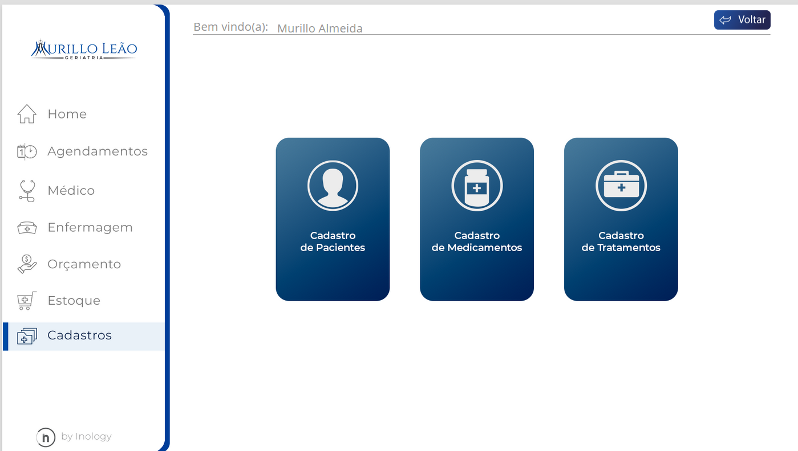

* Tela de cadasto de paciente

Na tela de cadastro de paciente é listado todos os paciente cadastrados podendo: **cadastrar**, **excluir** e **editar**

  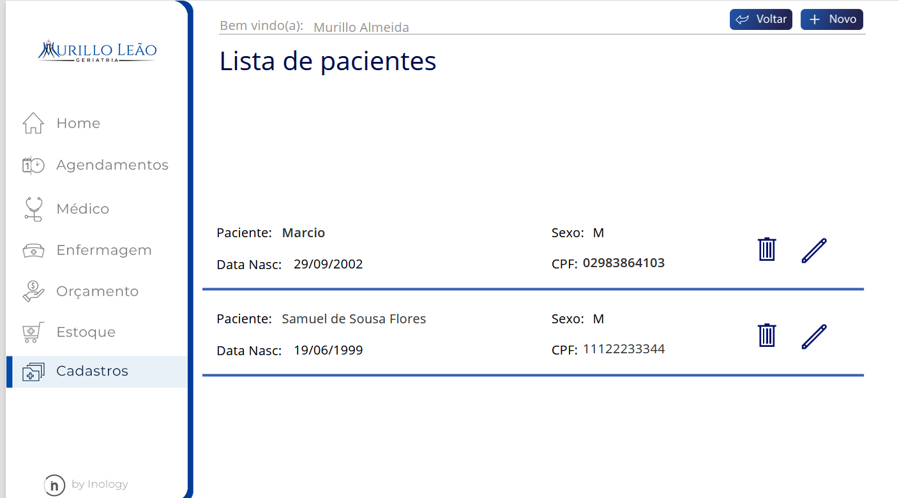
  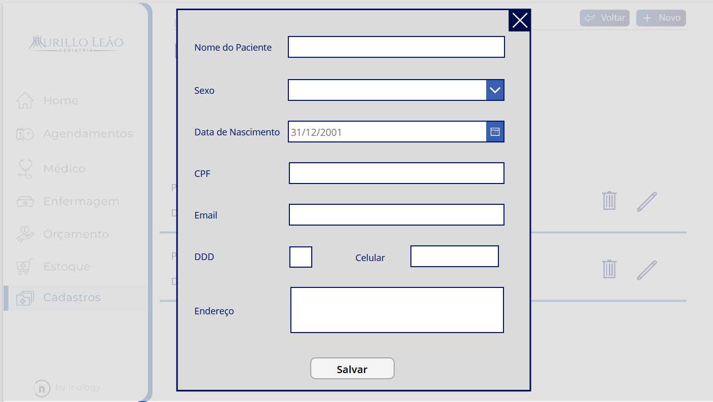

* Tela de cadasto de medicamento

Na tela de cadastro de medicamento é listado todos os medicamentos cadastrados podendo: **cadastrar**, **excluir** e **editar**

  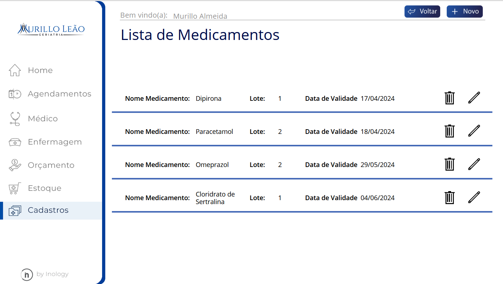
  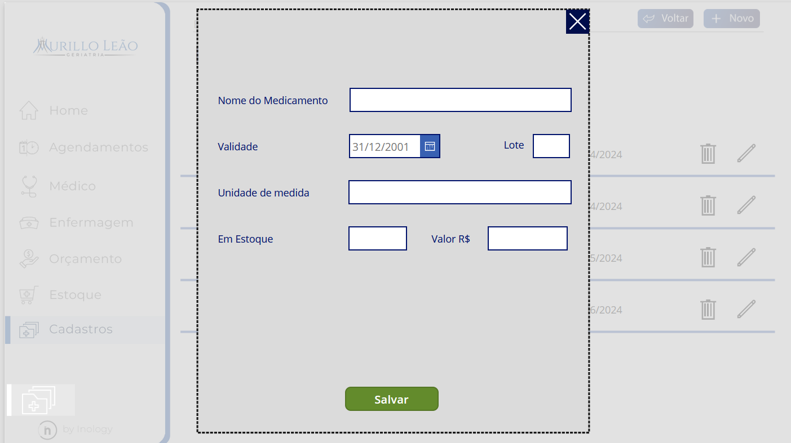

* Tela de cadasto de tratamento

Na tela de cadastro de tratamento é listado todos os tratamentos cadastrados podendo: **cadastrar**, **excluir** e **editar**.

  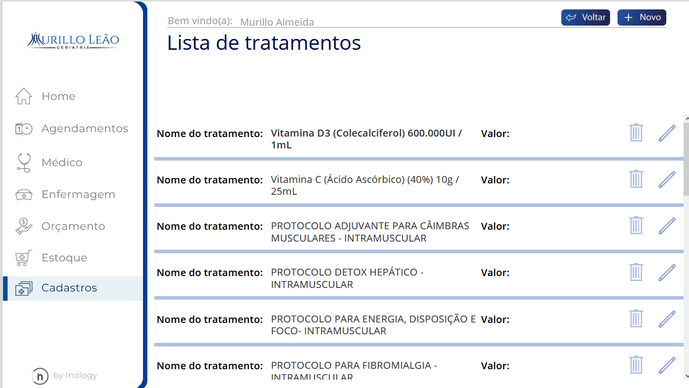
  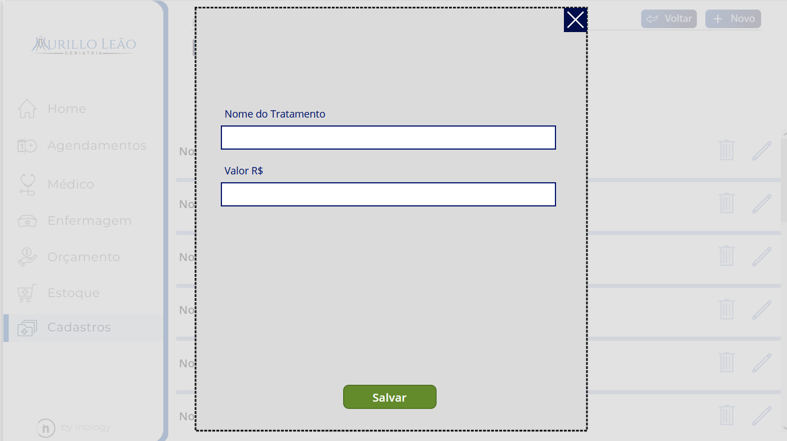

* Seção de Estoque

Na aba de estoque temos todos os medicamentos cadastrados sendo possível fazer movitações de **entrada** e **saída**.

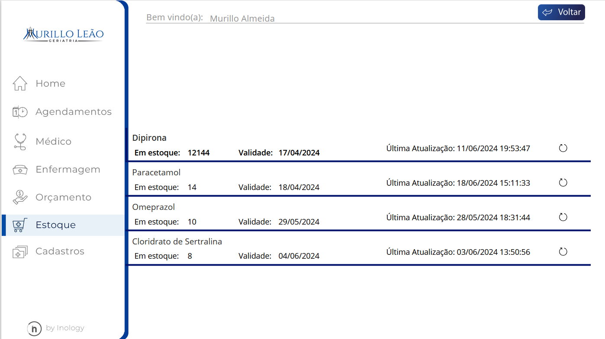

* Seção de Orçamento

Em Orçamento o gestor resposável pela clínica poderá visualizar um painel BI que é alimentado pelos dados das movimentações de medicamento e tratamento.

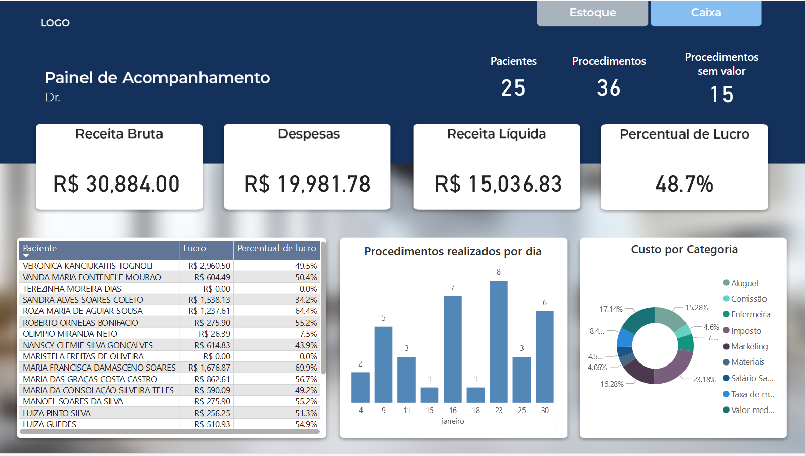

* Seção de Enfermagem

Em Enfermagem será visto a agenda do dia dos pacientes marcados com o enfermeiro e no ícone de **tesoura** será feito o início do atendimento do paciente.

  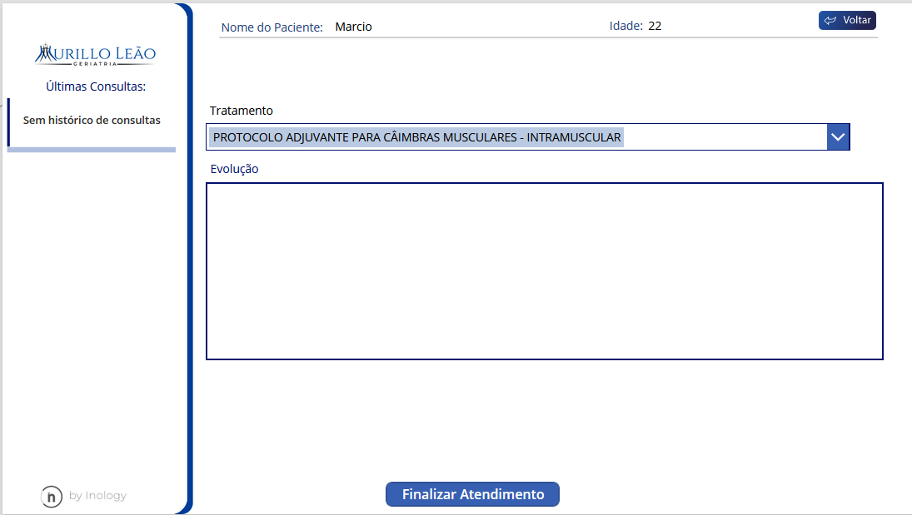

* Seção do Médico

Em Médico será visto a agenda do dia dos pacientes marcados com o médico e no ícone do **estetoscópio** será feito o início do atendimento do paciente.

  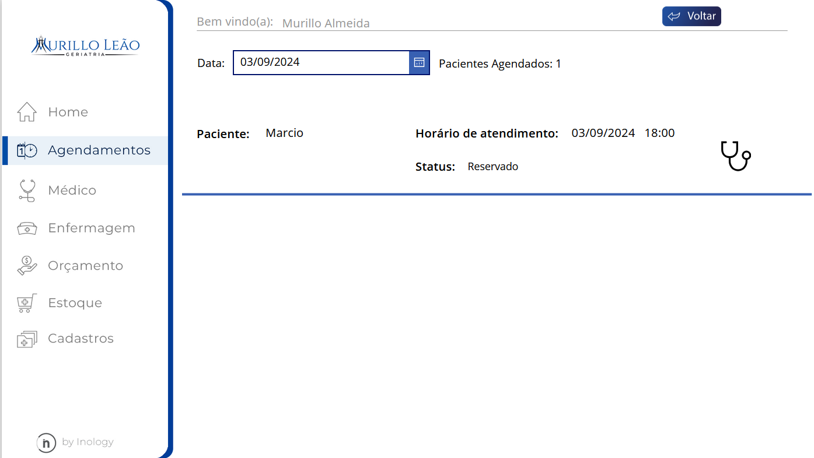
  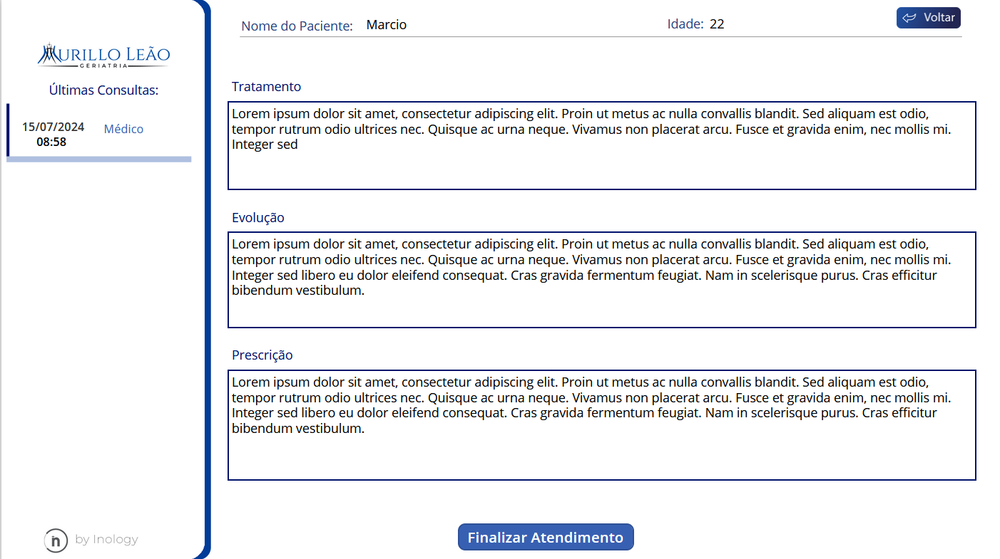

* Seção de Agendamento

Em agendamento o secretário terá funções de agendar e alterar o status de um paciente (que é previamente é cadastrado na **tela cadastro paciente**)

  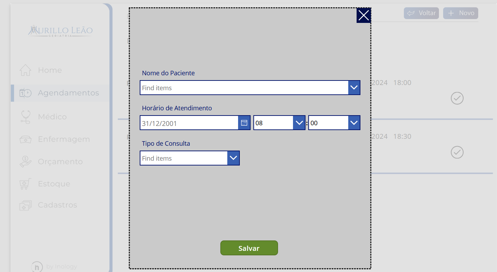
  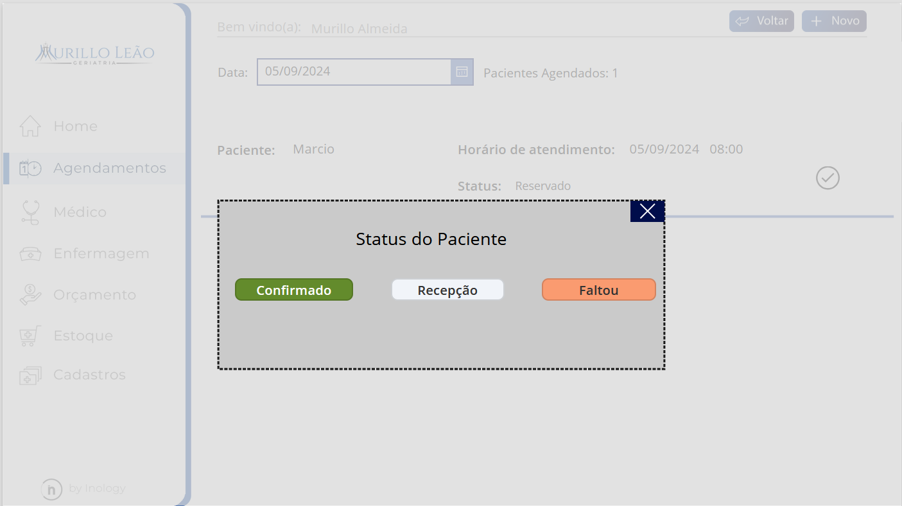

 

## Impacto

-----

        

            <h4>Eficiência Operacional</h4>
            <ul>
                <li>Automação de processos</li>
                <li>Gestão de estoque otimizada</li>
            </ul>
        

        

            <h4>Aumento do controle e Visibilidade</h4>
            <ul>
                <li>Visão clara dos dados</li>
                <li>Redução de erros</li>
                <li>Vantagem comercial</li>
            </ul>
        

        

            <h4>Produtividade e Organização interna</h4>
            <ul>
                <li>Maior produtividade</li>
                <li>Integração e comunicação</li>
            </ul>
        

    

